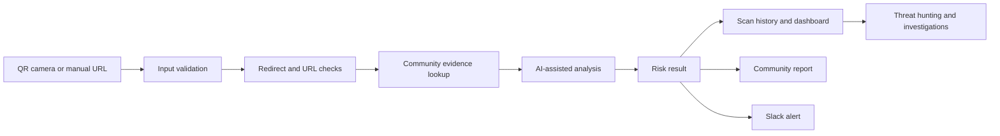

# QR Secures

QR Secures is a mobile-first cybersecurity application that checks QR-code content and manually entered URLs before a user opens them. The current application uses a Base44 backend, a React interface, AI-assisted URL analysis, SSL checks, community reports, scan history, investigation tools, and Slack alerting.

**Live application:** [qrsecures.base44.app](https://qrsecures.base44.app)

> This repository documents the academic project and the deployed application. The Base44 source export is not included because the current Base44 plan does not permit ZIP export. No credentials, user records, private scan history, or repeated draft submissions are stored here.

## Project evolution

QR Secures developed in two related phases:

1. **Practicum (Fall 2025):** a character-level CNN, heuristic URL checks, SSL/TLS inspection, and a weighted decision engine were evaluated as a malicious-URL detector.
2. **Capstone (Winter 2026):** the project became a user-facing Base44 application with QR scanning, AI-assisted analysis, dashboards, community reporting, threat hunting, investigations, watchlists, and Slack integration.

The current application should not be described as if it directly runs the earlier CNN unless the exported implementation or deployment configuration proves that connection. See [Evidence and claim status](docs/evidence-and-claims.md).

## Current application

The application provides:

- camera-based QR scanning and manual URL entry;
- risk results with a 0-100 score, classification, confidence, and supporting indicators;
- scan history and analytics;
- community threat and false-positive reports;
- analyst tools for hunting, investigations, annotations, and watchlists;
- role-based access for users, analysts, and administrators;
- manual and automated Slack alert workflows.

The bottom navigation exposes Home, Scan, and History. Additional pages appear according to role.

## Architecture



The architecture above reflects the documented Base44 application. Some implementation details remain subject to source-code verification.

## Repository map

```text
.
├── README.md
├── SECURITY.md
├── LICENSE
├── docs/
│   ├── app-guide.md
│   ├── architecture.md
│   ├── evidence-and-claims.md
│   └── project-history.md
└── academic/
    ├── capstone/
    └── practicum/
```

Only the strongest final artifacts are retained. Templates, duplicate exports, personal logbooks, speaker-script variants, and draft presentations were reviewed but intentionally omitted.

## Academic team

- Manea Al-Shabrain, project leader
- Sulaiman Abdo
- Saeed Alsawaf
- Mohammad Albustami
- Salah Alharbi
- Supervisor: Dr. Adnan

The project was completed in the B.Sc. Cyber Security and Data program at the College of Computing and Information Technology.

## Responsible use

QR Secures provides risk guidance, not a guarantee that a URL is safe. AI output, SSL status, redirects, and community reports can each be incomplete or wrong. Do not submit confidential URLs, credentials, private tokens, internal hostnames, or personal information for analysis.

## Documentation

- [Application guide](docs/app-guide.md)
- [Architecture](docs/architecture.md)
- [Evidence and claim status](docs/evidence-and-claims.md)
- [Project history](docs/project-history.md)
- [Security policy](SECURITY.md)

