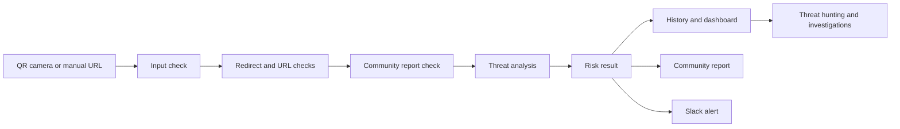

# QR Secures

QR Secures helps people check a QR code or web address before opening it. The application examines the link for warning signs and explains the result in plain language. It can also save previous scans, collect community reports, support investigations, and send alerts to Slack.

Live application: [qrsecures.base44.app](https://qrsecures.base44.app)

This repository documents the academic project and the working Base44 application. It does not contain the application source because the current Base44 plan does not allow source export. It also excludes account details, scan records, credentials, and repeated drafts of the same academic files.

## How the project developed

The work developed through two course stages.

1. During the Fall 2025 practicum, the team trained and compared deep learning models for malicious URL detection. The final design combined a character level CNN with URL rules and SSL certificate checks.
2. During the Winter 2026 capstone, the team developed a Base44 application that people can use from a phone or computer. It added QR scanning, URL analysis, history, dashboards, community reports, investigation tools, watchlists, and Slack alerts.

The available material does not prove that the current Base44 application runs the earlier CNN model. The two stages are connected, but their results must be described separately. The [evidence review](docs/evidence-and-claims.md) explains this distinction.

## What the application can do

Users can scan a QR code with the camera or enter a web address manually. The result includes a score from 0 to 100, a risk level, a confidence value, and the reasons behind the assessment.

The application also includes scan history and charts. Community members can report threats or incorrect results. Analysts can review activity, add notes, group scans into investigations, and monitor domains or patterns. Administrators can manage users. Slack integration can send security alerts to a selected channel.

The main navigation contains Home, Scan, and History. Extra pages appear when the signed in account has the required role.

## How a scan moves through the application

This diagram reflects the application material reviewed for this repository. The source code is needed to confirm some details.

## Repository contents

The `docs` folder explains the application, architecture, evidence, and project history. The `academic` folder contains one final report from each course stage. Templates, duplicate exports, individual logbooks, draft slides, and repeated speaker scripts were reviewed and left out.

## Academic team

Manea Al Shabrain led the project. The other team members were Sulaiman Abdo, Saeed Alsawaf, Mohammad Albustami, and Salah Alharbi. Dr. Adnan supervised the work.

The project was completed in the B.Sc. Cyber Security and Data program at the College of Computing and Information Technology.

## Using the application responsibly

QR Secures gives the user a security assessment. It cannot guarantee that a website is safe. A website can change after a scan, and any automated result can be wrong. Users should never submit passwords, private links, access tokens, internal addresses, or personal information.

## More information

Read the [application guide](docs/app-guide.md), [architecture notes](docs/architecture.md), [evidence review](docs/evidence-and-claims.md), [project history](docs/project-history.md), and [security policy](SECURITY.md).
